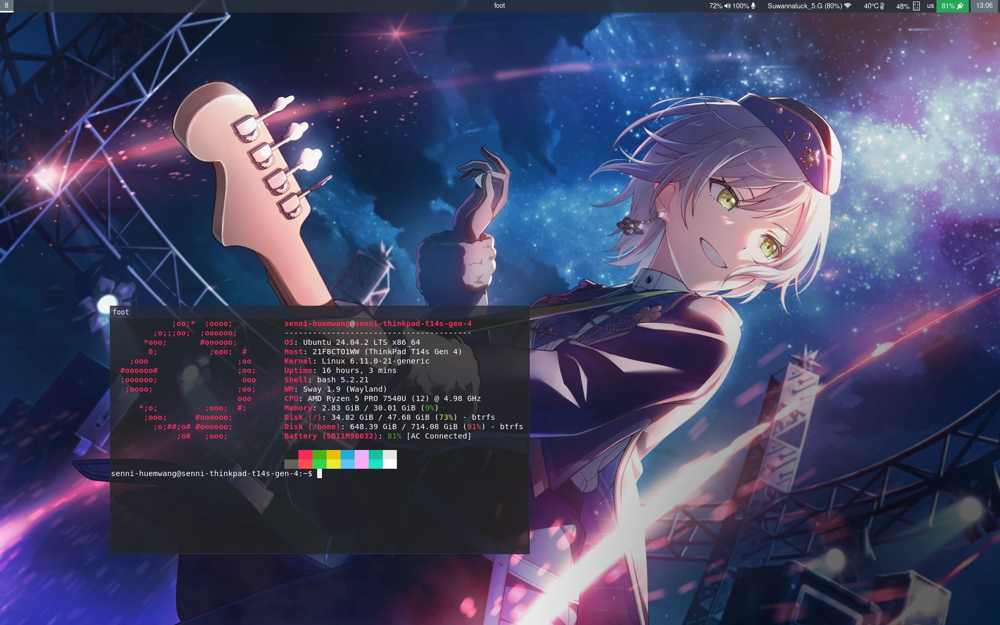

# Dotfiles for my swaywm and neovim

## Instructions

Put all the directories under $HOME/.config/, and install required packages.

- sway
- swaybg
- waybar
- fuzzel
- brightnessctl-utils
- gtklock
- grim
- grimshot

In order for brightness controls to function properly, you must add yourself into "video" and "input" group.

`sudo usermod -a -G video,input USER`
