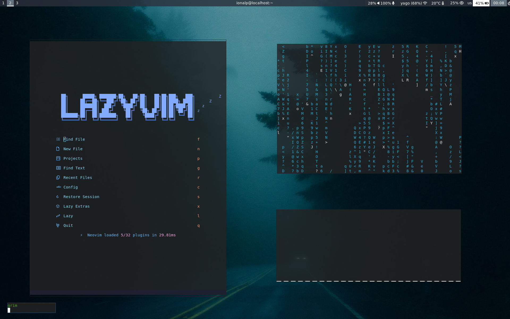

# Remake of Senni Dotfiles

A customized set of Sway configuration files and utilities for a minimal Wayland desktop environment.

---

## Requirements

Install the following packages for full functionality:

* sway
* swaybg
* waybar
* brightnessctl-utils
* fuzzel
* swayidle
* gtklock
* grim
* slurp
* grimshot
* playerctl
* bemoji (\~/.local/bin/bemoji)
* swayr (install via cargo, binary in \~/.cargo/bin)
* sway-notification-center
* autotiling (\~/.local/bin/autotiling)
* foot (or your preferred terminal)
* cava
* yazi
* fastfetch
* neovim + vim-plug
* fonts-awesome

Add your user to the "video" and "input" groups for brightness and input control: sudo usermod -a -G video,input USER

---

## Installation

1. Clone this repository: git clone [https://github.com/YOUR\_USERNAME/REPO\_NAME.git](https://github.com/YOUR_USERNAME/REPO_NAME.git) cd REPO\_NAME
2. Copy configuration directories to \$HOME/.config/.
3. Make sure binaries like bemoji, swayr, and autotiling are in your \$PATH.
4. Launch Sway.

---

## Keyboard Layout

* Mod key: Super (Windows key)
* Keyboard layouts: US and TH, switch using Caps Lock
* Navigation: Arrow keys or h/j/k/l

---

## Key Bindings

Keybind: \$mod+Return | Function: Open terminal (foot)
Keybind: \$mod+Backspace | Function: Kill focused window
Keybind: \$mod+d | Function: Open application launcher (fuzzel)
Keybind: \$mod+Shift+e | Function: Exit Sway session
Keybind: \$mod+h/j/k/l | Function: Move focus between windows
Keybind: \$mod+Shift+h/j/k/l | Function: Move windows in workspace
Keybind: \$mod+\[1-0] | Function: Switch workspaces
Keybind: \$mod+Shift+\[1-0] | Function: Move focused window to workspace
Keybind: \$mod+v | Function: Toggle floating window
Keybind: \$mod+r | Function: Enter resize mode (use arrows or h/j/k/l, exit with Enter/Esc)
Keybind: \$mod+Shift+- | Function: Move focused window to scratchpad
Keybind: \$mod+- | Function: Show window from scratchpad
Keybind: \$mod+Print | Function: Take screenshot of full screen (grim & grimshot)
Keybind: \$mod+Shift+Print | Function: Take screenshot of window
Keybind: \$mod+Ctrl+Space | Function: Open emoji picker (bemoji)
Keybind: \$mod+\ | Function: Switch window (swayr)
Keybind: \$mod+n | Function: Open notification center (swaync)
Touchpad swipe left/right | Function: Switch workspaces

---

## Notes

* Default wallpaper is set to /usr/share/backgrounds/sway/Sway\_Wallpaper\_Blue\_1920x1080.png.
* Floating windows can be dragged with \$mod + left mouse and resized with \$mod + right mouse.
* Touchpad gestures: swipe right: previous workspace, swipe left: next workspace
* Volume and brightness keys require the user to be in video and input groups.
* autotiling runs automatically.
* sway-notification-center daemon runs automatically.

This dotfiles setup is optimized for a US+TH keyboard layout, vim-style navigation, and a modern Wayland workflow.
